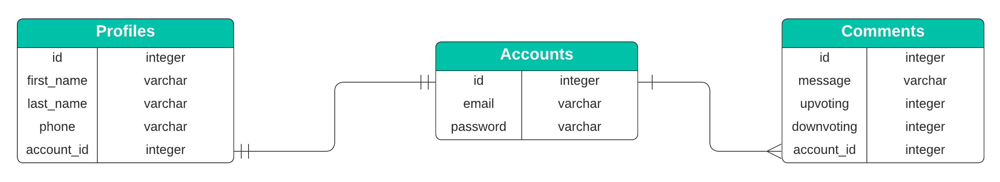

# Exercise Sequelize: 1:1 and 1:N relationships

In this exercise, the creation of **1:1** and **1:N** relationships was exercised using Sequelize _Object-Relational Mapping_ (ORM).

At the end of the exercise, the following learning objectives are expected to be achieved:

- Identify situations that require a 1:1 relationship or a 1:N relationship;👀
- Apply the concepts of 1:1 relationship and 1:N relationship using Sequelize; :smirk:
- Recognize the importance of correctly using the 1:1 and 1:N relationship in databases in the software development process. :heart_eyes:

## 🛠 Modules used

This project was built using Node 16.15.1 together with the following modules:

- express 4.18.1
- sequelize 6.21.1
- sequelize-cli 6.4.1
- dotenv 16.0.1
- mysql2 2.3.3
- nodemon 2.0.19
- joi 17.7.0

## 🌍 Blog Comments

The beginning of the 2000s was marked by the popularization of **blogs**, a _Web_ application whose structure allows quick updating based on additions to so-called articles, posts or publications.

One of the relevant capabilities of a **blog** is the ability for readers to leave comments on posts, allowing them to interact with other people, including the person who posted the post.

In this exercise you will implement a simple comment storage mechanism (a very simplistic clipping of a blog _Web_ application) but which will allow you to exercise the 1:1 and 1:N relationship concepts learned in the **course**. :tada:

We will work with the Database Management System (DBMS) MySQL 8.0, creating a database according to the entity-relationship diagram (ERD) shown below:



In the diagram we can see the existence of three tables:

- **Accounts**: Table responsible for storing the data of the Web application access account.
- **Profiles**: Table responsible for storing the profile data of a Web application access account.
- **Comments**: Table responsible for storing data referring to comments made by the Web application access accounts.

An important point to note in the diagram is how the entities are linked (related):

- Between the **Accounts** and **Profiles** tables there is a `one to one` relationship, that is, an access account has only one profile.
- Likewise, tables **Accounts** and **Comments** have a `one to many` relationship, that is, an access account can have several comments associated with it.

### ⚠️ Creating the database and starting the application

<details><summary><strong>Instructions for running the application locally</strong></summary>

1. First it will be necessary to create an `.env` file that has the necessary environment variables for the application to access your MySQL DBMS (there is a file called `.env.example` which can be copied and renamed to `.env `).

The '.env' file must contain the following content:

```bash
DATABASE_USER=root
DATABASE_PASSWORD=password
DATABASE_HOSTNAME=hostname
PORT=3001
```

Where:

- _DATABASE_USER_: MySQL username. Here we are using the **root** user but, in a production environment, you should use another user for security reasons;
- _DATABASE_PASSWORD_: The password of the username specified in _DATABASE_USER_;
- _DATABASE_HOSTNAME_: The name of the _host_ (host computer) on which the MySQL server is running. If you are running the MySQL server on your local computer the value should be `127.0.0.1`;
- _PORT_: The port used by the Node API server.

2. Install dependencies

```bash
npm install
```

3. Run the following commands to create the `trybe_blog_comment` database on your MySQL server and populate the tables with some data

```bash
npx sequelize-cli db:drop
npx sequelize-cli db:create
npx sequelize-cli db:migrate
npx sequelize-cli db:seed:all
```

4. Start the API server

```bash
npm run debug
```

</details>

<details><summary><strong>Instructions for running the application via Docker</strong></summary>
  
There is a `docker-compose.yml` file set up if you want to run containers via Docker.

1. Start containers

```bash
docker-compose up -d
```

2. Access the API Container

```bash
docker exec -it exercise-sequelize-associations-11-1n-api-1 bash
```

3. Install dependencies

```bash
npm install
```

4. Run the following commands to create the `trybe_blog_comment` database on your MySQL server and populate the tables with some data

```bash
npx sequelize-cli db:drop
npx sequelize-cli db:create
npx sequelize-cli db:migrate
npx sequelize-cli db:seed:all
```

5. Start the API server

```bash
npm run debug
```

</details>
