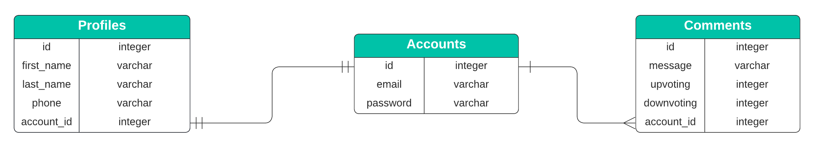

# Exercício Sequelize: Relacionamentos 1:1 e 1:N

Nesse exercício foi exercitado a criação de relacionamentos **1:1** e **1:N** utilizando o _Object-Relational Mapping_ (ORM) Sequelize.

Ao final do exercício é esperado que os seguintes objetivos de aprendizagem sejam atingidos:

- Identificar as situações que requerem um relacionamento 1:1 ou um relacionamento 1:N; 👀
- Aplicar os conceitos de relacionamento 1:1 e relacionamento 1:N utilizando o Sequelize; :smirk:
- Reconhecer a importância do emprego correto do relacionamento 1:1 e 1:N em base de dados no processo de desenvolvimento de software. :heart_eyes:

## 🛠 Módulos utilizados

Esse projeto foi construído utilizando Node 16.15.1 em conjunto com os seguintes módulos:

- express 4.18.1
- sequelize 6.21.1
- sequelize-cli 6.4.1
- dotenv 16.0.1
- mysql2 2.3.3
- nodemon 2.0.19
- joi 17.7.0

## 🌍 Blog Comments

O início dos anos 2000 foi marcado com a popularização dos **blogs**, uma aplicação _Web_ cuja a estrutura permite a atualização rápida a partir de acréscimos dos chamados artigos, postagens ou publicações.

Uma das capacidades relevantes de um **blog** é a capacidade de leitores deixarem comentários nas postagens, permitindo interagir com outras pessoas, incluindo a pessoa autora da postagem.

No presente exercício você irá implementar um mecanismo simples de armazenamento de comentários (um recorte bem simplista de uma aplicação _Web_ de blog) mas que permitirá exercitar os conceitos de relacionamento 1:1 e 1:N aprendidos no **course**. :tada:

Iremos trabalhar com o Sistema Gerenciador de Banco de Dados (SGBD) MySQL 8.0, criando uma base de dados de acordo com o diagrama entidade-relacionamento (DER) mostrado abaixo:



No diagrama podemos ver a existência de três tabelas:

- **Accounts (Contas)**: Tabela responsável por armazenar os dados da conta de acesso da aplicação Web.
- **Profiles (Perfis)**: Tabela responsável por armazenar os dados de perfil de uma conta de acesso da aplicação Web.
- **Comments (Comentários)**: Tabela responsável por armazenar os dados referentes a comentários realizados pelas contas de acesso da aplicação Web.

Um ponto importante a se notar no diagrama é como as entidades estão ligadas (relacionadas):

- Entre as tabelas **Accounts** e **Profiles** existe uma relação `um para um`, ou seja, uma conta de acesso possui apenas um único perfil.
- Do mesmo modo as tabelas **Accounts** e **Comments** possui um relacionamento `um para muitos`, ou seja, uma conta de acesso pode possuir vários comentários associados a ela.

### ⚠️ Criação do banco de dados e iniciando a aplicação

<details><summary><strong>Instruções para rodar a aplicação localmente</strong></summary>

1. Primeiramente será necessário criar um arquivo `.env` que tenha as variáveis de ambiente necessárias para que a aplicação acesse seu SGBD MySQL (existe um arquivo chamado de `.env.example` o qual pode ser copiado e renomeado para `.env`).

O arquivo '.env' deve conter o seguinte conteúdo:

```bash
DATABASE_USER=root
DATABASE_PASSWORD=password
DATABASE_HOSTNAME=hostname
PORT=3001
```

Onde:

- _DATABASE_USER_: Nome de usuário do MySQL. Aqui estamos utilizando o usuário **root** mas, em um ambiente de produção, deve-se utilizar um outro usuário por questões de segurança;
- _DATABASE_PASSWORD_: A senha do nome de usuário especificado em _DATABASE_USER_;
- _DATABASE_HOSTNAME_: O nome do _host_ (computador hospedeiro) no qual o servidor MySQL está sendo executado. Caso você esteja executando o servidor MySQL no seu computador local o valor deve ser `127.0.0.1`;
- _PORT_: A porta usada pelo servidor Node da API.

2. Instale as dependências

```bash
npm install
```

3. Execute os seguintes comandos para criar a base de dados `trybe_blog_comment` no seu servidor MySQL e popular as tabelas com alguns dados

```bash
npx sequelize-cli db:drop
npx sequelize-cli db:create
npx sequelize-cli db:migrate
npx sequelize-cli db:seed:all
```

4. Inicie o servidor da API

```bash
npm run debug
```

</details>

<details><summary><strong>Instruções para rodar a aplicação via Docker</strong></summary>
  
Existe um arquivo `docker-compose.yml` configurado caso queira rodar os contêineres via Docker.

1. Inicie os contêineres

```bash
docker-compose up -d
```

2. Acesse o contêiner da API

```bash
docker exec -it exercise-sequelize-associations-11-1n-api-1 bash
```

3. Instale as dependências

```bash
npm install
```

4. Execute os seguintes comandos para criar a base de dados `trybe_blog_comment` no seu servidor MySQL e popular as tabelas com alguns dados

```bash
npx sequelize-cli db:drop
npx sequelize-cli db:create
npx sequelize-cli db:migrate
npx sequelize-cli db:seed:all
```

5. Inicie o servidor da API

```bash
npm run debug
```

</details>
