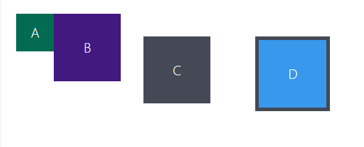

# 3.3 Exercises:

---

## Box model - Model of boxes in CSS

### [Exercise 1](./exercise_1/index.html)

-   Reproduce this item schema:
    

---

## Positioning elements

### [Exercise 2](./exercises_2/index.html)

> Characters belonging to Nintendo©

-   Position Mario above Goomba.
-   Position the p tag so that it is inside the speech bubble.
-   Position the balloon so that it becomes a Bowser speech.

---
