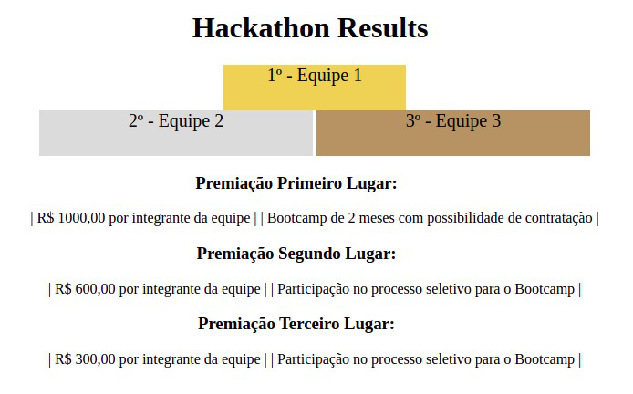

# 3.4 Exercises:

---

## Block elements and inline elements

### [Exercise 1](./exercises_1)

-   Reproduce this item schema:
    

---

## Block elements and inline elements

### [Exercise 2](./exercises_2)

1. Add a header to the page with the title Punch at 80km/h: Meet the Stomatopoda.

2. Add a set of links that represent the navigation area of ​​the site.

    - Create a link called Home.
    - Create a link called About.
    - Create a link called Contact.

3. Create an article that will contain interesting facts about Stomatopoda. The article will be subtitled Stomatopoda Facts. Here's an animal site for inspiration to get facts.

4. Divide the article into sections, organizing it as follows:

    - A first section containing general information about the animal. The subtitle for this section is up to you. Its scientific name must be included in this section, which is Odontodactylus scyllarus, in italics. In addition, there must be tabular information regarding its scientific classification, specifically: Kingdom, Phylum, Subphylum, Class, Subclass and Order. Such information can be obtained from Wikipedia.
    - The other sections concern the interesting facts you have chosen about the animal. For each fact chosen you will create a section.
    - Add, for each section, a subtitle referring to the chosen fact.
    - Add, for each section, paragraph(s) describing the chosen fact. Highlight impressive features regarding the suit you have chosen, in order to reinforce the uniqueness of Stomatopoda. For example, if you create a section detailing the animal's powerful punch, it would be interesting to highlight the speed of that punch (80km/h) in bold.
    - Add, for each section, an image, as a way of illustrating the fact.
    - Finally, add a bibliographic references section, containing a list of all the links that were used as a basis for compiling the page in question.

5. Add adjacent content to the article, providing a link to a video that shows the animal in action.

6. Add a footer to the page, showing something like this:

```
Content compiled by <insert your name>, <current year>
```

> Note: for this exercise, it is mandatory to use at least 6 elements with the following tags: header, nav, article, section, h1, h2, h3, aside, footer, table and img.

---
