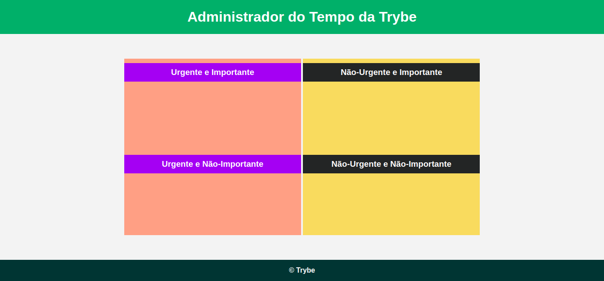

# JavaScript - DOM e seletores

---

## Parte II - Seletores de elementos

### [Exercício 1](./exercise_1/)

1. Recupere o elemento que contém o título da página e faça algo com ele, como alterá-lo para o nome do seu filme favorito.
2. Agora recupere o segundo parágrafo e use sua criatividade para alterá-lo.
3. Por fim, recupere o subtítulo e altere-o também.

### [Exercício 2](./exercise_2/)

1. Adicione uma classe igual para os dois parágrafos.
2. Recupere os seus parágrafos via código JavaScript, usando a função getElementsByClassName;
3. Altere algum estilo do primeiro deles.
4. Recupere o subtítulo e altere a cor dele usando a função getElementsByTagName.

---

## Parte III - Seletores de elementos

### [Exercício 1](./exercise_3/)

-   Para praticar, substitua todas as funções que você usou no exercício anterior por `querySelector` e/ou `querySelectorAll`.

### [Exercício 2](./exercise_4/)

-   Além disso, vamos consolidar a manipulação dos elementos HTML, colocando a cor do Administrador de Tempo da Trybe como na imagem abaixo usando apenas o JavaScript!

> Você vai precisar usar o que aprendeu sobre getElementBy e querySelector para colocar em prática.

---

## Funções de manipulação do DOM

### [Exercício 1](./exercise_5/)

-   Aqui você vai modificar os elementos já existentes utilizando apenas as funções:
    -   document.getElementById()
    -   document.getElementsByClassName()
    -   document.getElementsByTagName()

1. Crie uma função que mude o texto na tag `
` para uma descrição de como você se vê daqui a 2 anos. (Não gaste tempo pensando no texto e sim realizando o exercício)
2. Crie uma função que mude a cor do quadrado amarelo para o verde da Trybe `(rgb(76,164,109))`.
3. Crie uma função que mude a cor do quadrado vermelho para branco.
4. Crie uma função que corrija o texto da tag `<h1>`.
5. Crie uma função que modifique todo o texto da tag `
` para maiúsculo.
6. Crie uma função que exiba o conteúdo de todas as tags `
` no console.
