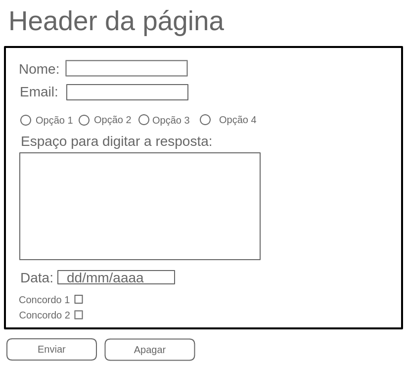

# JavaScript - HTML & CSS - Forms

---

## Part II - input tag, types and attributes:

### [Exercise 1](./exercise_1/)

> Let's practice a little, creating a login screen. 🔥

1. Add input fields for email and password.
2. Add a checkbox with the text Remind me.
3. Add a button with the text Enter.
4. Add the placeholders Enter your email and Enter your password for the email and password fields.
5. Add the required attribute to the email and password fields.
6. Add the autocomplete="off" attribute to the email field.
7. Add the autofocus attribute to the email field.

---

## Part IV - Understand the prevent default

### [Exercise 2](./exercise_2/)

- Create an HTML index.html file
- Create a Javascript script.js file
- In your HTML file
  - Add the <script src="script.js"></script> at the end of the HTML body
  - Copy the above three elements (a, input type="text", checkbox) into your page
- In your Javascript file
  - Add the selectors below at the beginning of the file

```
// SELECTORS
const INPUT_TEXT = document.querySelector("#input-text");
const INPUT_CHECKBOX = document.querySelector("#input-checkbox");
const HREF_LINK = document.querySelector("#href");
```

1. Add a `click` event to the `a` element that has the `href` id. In the event function, implement the `.preventDefault()` method to prevent the element's default behavior. That is, when you click on the link, nothing should happen.
2. Add a `click` event to the `checkbox` element that has the `input-checkbox` id. In the event function, implement the `.preventDefault()` method to prevent the element's default behavior. That is, when you click on the box, nothing should happen.
3. Add a `keypress` event to the `input type="text"` element that has the id `input-text`. In the event function, implement the `.preventDefault()` method so that only the character `a` (lowercase letter 'a') can be typed in the box.

---

## Exercises

### [Exercise 3](./exercise_3/)

> Creating a form to apply for a trip
> Imagine you are surfing the internet. You are now a developer, tired after finally finishing your studies and thinking about your wonderful and well-deserved vacation.
> Then you come across an ad for the TrybeTrip contest, which rewards you with a fully paid trip and multiple destination options. How do you imagine the page to compete for this trip would be?
> Do you agree that it would be a kind of form?
> The exercise today will be to develop a web page with the TrybeTrip form. Develop it into a file called `form.html`. The structure of your page should look similar to the image below.



1. The form must allow the user to enter the following fields:

- Full name:
  - Limited between 10 and 40 characters.
- Email:
  - Limited between 10 and 50 characters.
- Preferred Destination:
  - 4 options: City, Countryside, Beach, Mountains.
- Why should you be the developer to win the TrybeTrip contest?
  - Limit of 500 characters.
- What is the best date to make your trip?
- Would you like to receive other amazing opportunities offered by Trybe?
- I agree that images from my vacations may be used to publicize future contests.

> These will be the main fields used in the next exercises.

2. Create a button to submit the filled information.
   Now let's use some javascript, for that create the `script.js` file and reference it in the HTML.

- Tip: Put the `<script>` tag at the end of your body.

3. Interrupt the default behavior of the submit button using the `preventDefault()` method. Our friend Carol Silva told us a little about how to do this, remember?

4. Create a button that clears the information contained in the fields;

> ### Bonus 🚀

1. TrybeTrip really needs photos to publicize their contests. With this in mind, ensure that only those who authorize the use of images can submit their information.

2. Validate the character limit fields. If they are not as expected when clicking the submit button, an alert should be shown with the message: 'Invalid Data'. Otherwise, the message 'Data successfully sent! Thank you for participating in the TrybeTrip contest.' should appear on the screen.
