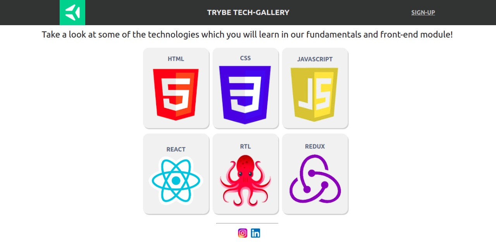

# This is a project for the content of `CSS Flexbox`.

### STARTING THE EXERCISES

#### Exercise 1

- Create a header for your application using the `header` tag. This header **must** have 3 elements and these must be positioned using **Flexbox**. The result should be similar to the structure of the "Trybe Tech-Gallery" page. Look at the examples below:
  

#### Exercise 2

- Implement the contents of the first `section`. This section must contain at least one text element. Using **Flexbox**, position it according to the example below.
  

#### Exercise 3

- Implement the placement of the second `section`. This section must contain at least 6 images and a title for each one. Feel free to use your imagination and select the images you prefer, just don't forget to follow the proposed placement structure. 😉
  

#### Exercise 4

- Finally, make the positioning of the footer/footer, this is the last element necessary for our application to be complete. The footer **must** contain at least 2 elements. For the example, images were added that redirect the user to Trybe's social networks.
  
