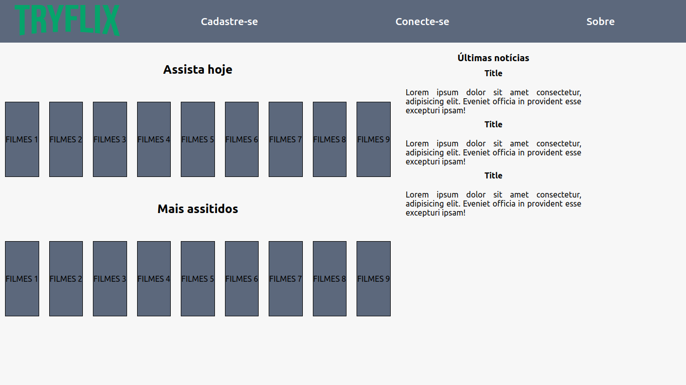
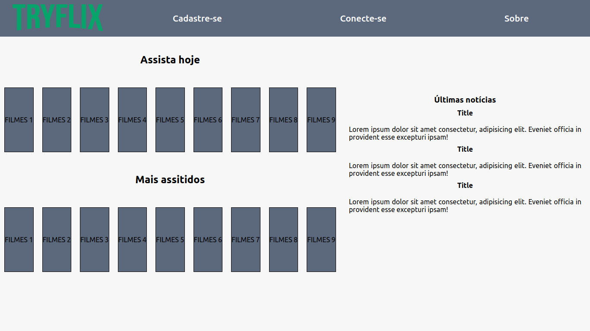
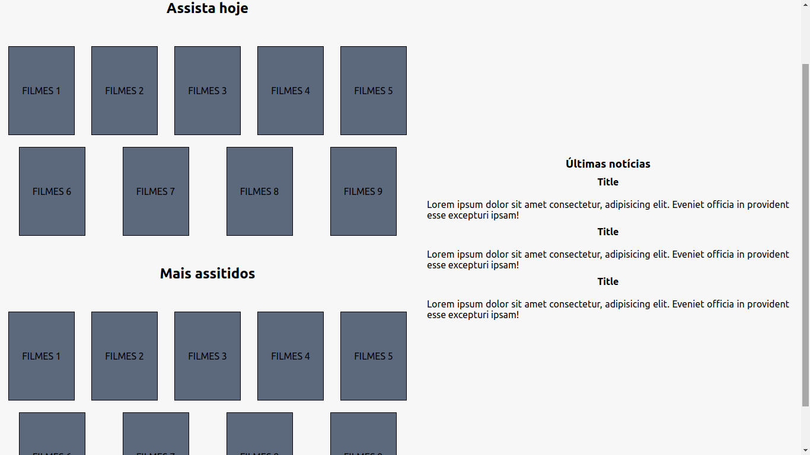
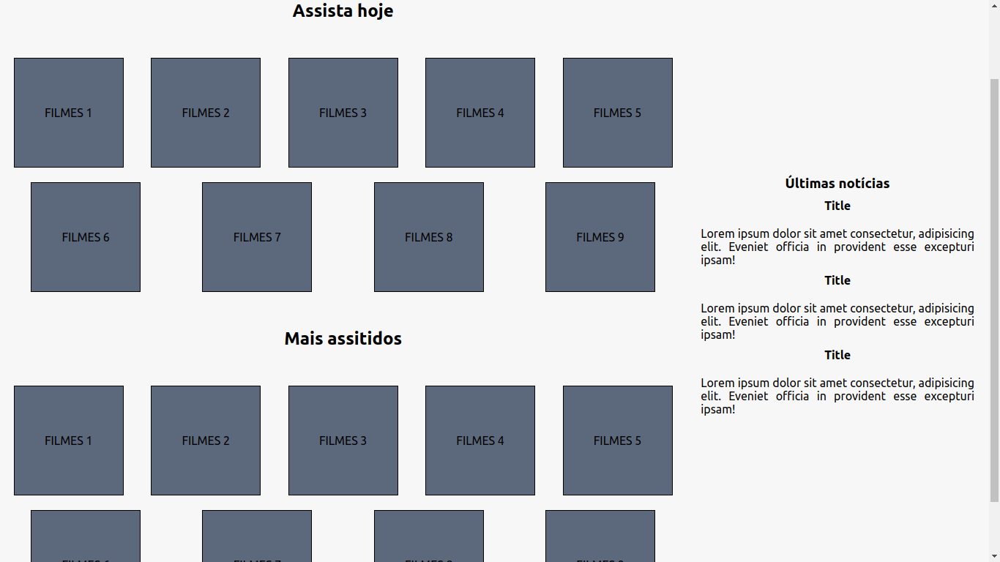
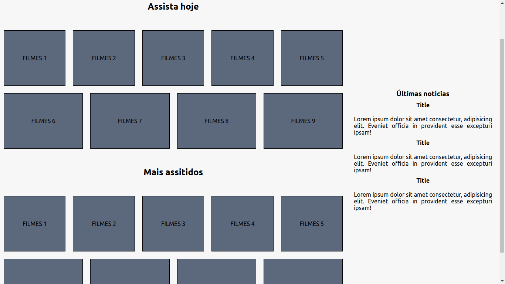

# Flexbox exercises

---

> For the following exercises, create an HTML file and a CSS file, copy the code below, and follow the instructions in each statement.

<details>
<summary>HTML code</summary>

```
<!DOCTYPE html>
<html lang="pt">
  <head>
    <meta charset="UTF-8">
    <meta name="viewport" content="width=device-width, initial-scale=1.0">
    <title>TRYFLIX</title>
    <link rel="stylesheet" href="./style.css">
  </head>
  <body>
    <header class="header-container">
      <nav class="menu-container">
        <ul>
          <li>Cadastre-se</li>
          <li>Conecte-se</li>
          <li>Sobre</li>
        </ul>
      </nav>
      <section class="logo-container">
        
      </section>
    </header>
  </body>
</html>
```

</details>

<details>
<summary>CSS code</summary>

```
* {
  margin: 0;
  padding: 0;
  box-sizing: border-box;
  font-family: 'Ubuntu';
}

body {
  background-color: rgb(247, 247, 247);
}

.header-container {
  background-color: #5C687C;
  display: flex;
}

.logo-container {
  display: flex;
  justify-content: center;
}

.menu-container {
  display: flex;
}

.menu-container ul {
  display: flex;
  justify-content: space-around;
  width: 100%;
}

.menu-container li {
  color: white;
  font-weight: 500;
  font-size: 1.3rem;
  list-style: none;
  margin-right: 10px;
}
```

</details>

---

## Part 1

### 1. Add a property that defines the base Flexbox size for the 268px image container and for the 500px menu container. After applying the properties, the header should be similar to the image below:


### 2. Add a Flexbox property that modifies the order in which the logo and menu items appear on the screen. After applying the property, the header should be similar to the image below:


### 3. Add a Flexbox property that makes the menu container grow when there is space available. After applying the property, the header should be similar to the image below:


### 4. Use the align-self property on the correct element so that the page header has the following behavior:


---

## Part 2

> Let's continue practicing with the continuation of the header performed in the exercise above and build a main with the rest of your page. Copy the rest of the HTML and CSS codes and apply to your previously created documents.

<details>
<summary>HTML code</summary>

```
    <main class="main-container">
      <section class="movie-container">
        <section>
          <h2>Assista hoje</h2>
          <div class="card-container">
            <div>FILMES 1</div>
            <div>FILMES 2</div>
            <div>FILMES 3</div>
            <div>FILMES 4</div>
            <div>FILMES 5</div>
            <div>FILMES 6</div>
            <div>FILMES 7</div>
            <div>FILMES 8</div>
            <div>FILMES 9</div>
          </div>
        </section>
        <article>
          <h2>Mais assitidos</h2>
          <div class="card-container">
            <div>FILMES 1</div>
            <div>FILMES 2</div>
            <div>FILMES 3</div>
            <div>FILMES 4</div>
            <div>FILMES 5</div>
            <div>FILMES 6</div>
            <div>FILMES 7</div>
            <div>FILMES 8</div>
            <div>FILMES 9</div>
          </div>
        </article>
      </section>
  <aside class="aside-container">
    <h3>Últimas notícias</h3>

    <h4>Title</h4>
    <p>Lorem ipsum dolor sit amet consectetur, adipisicing elit. Eveniet officia in provident esse excepturi ipsam!</p>

    <h4>Title</h4>
    <p>Lorem ipsum dolor sit amet consectetur, adipisicing elit. Eveniet officia in provident esse excepturi ipsam!</p>

    <h4>Title</h4>
    <p>Lorem ipsum dolor sit amet consectetur, adipisicing elit. Eveniet officia in provident esse excepturi ipsam!</p>

  </aside>
</main>
```

</details>

<details>
<summary>CSS code</summary>

```
.main-container {
  display: flex;
  flex-wrap: wrap;
}

.movie-container {
  display: flex;
  flex-direction: column;
}

.movie-container h2 {
  margin: 40px 0;
  text-align: center;
}

.card-container {
  display: flex;
  flex-wrap: wrap;
  justify-content: space-around;
}

.card-container div {
  align-items: center;
  background-color: #5C687C;
  border: black solid 1px;
  display: flex;
  height: 150px;
  justify-content: center;
  margin: 10px;
}

.aside-container {
  display: flex;
  flex-direction: column;
  margin: 20px;
}

.aside-container h3, h4 {
  margin-bottom: 10px;
  text-align: center;
}

.aside-container p {
  margin: 10px 0;
  text-align: justify;
}
```

</details>

### 1. Apply a 350px base to your aside container. It should look similar to the image below:



### 2. Apply one alignment to center and another to expand. Your aside exhibits the following behavior:



### 3. Add a property that makes your movie container have a base of 700px and another base of 16% for the div of your card container. It should look similar to the image below:



### 4. Apply a property with value 10 that expands the movie container. It should look similar to the image below:



### 5. Add a property with value 1 that makes your movie container div occupy all the white space. It should look similar to the image below:


